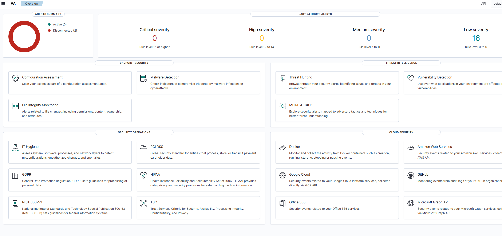

# Small SOC Lab in Wazuh

## Introduction

This is a SOC (Security Operations Center) laboratory that utilizes Wazuh for the SIEM (Security Information & Event Management) central platform. The goal of this lab is to simulate several real-world attack scenarios and observe how security monitoring tools detect and log malicious activity.

The environment consists of several monitored endpoints that send logs to a centralized Wazuh server. The server analyzes these logs, identifies potential threats, and generates security alerts.

## Objectives

Our goals for this project are:

- Deploy a centralized security monitoring solution via Wazuh
- Monitor multiple endpoints through dedicated Wazuh agents
- Simulate common attack types
- Analyze the security events generated from executing those attacks
- Demonstrate how a SOC analyst could investigate and respond to the generated alerts

## Laboratory Infrastructure

This laboratory infrastructure consists of four virtual machines hosted on VMware Workstation:

- **Wazuh Server (Ubuntu Server 22.04)** — The central logging and SIEM system.
- **Windows 10 Endpoint** — A monitored system on which the Wazuh agent is installed.
- **Ubuntu Desktop Endpoint** — Another monitored endpoint running Linux.
- **Kali Linux** — A simulated attacker workstation used to create security incidents.

The complete infrastructure build of this laboratory can be found in:

[Lab Architecture](docs/01-lab-architecture.md)
[Lab Setup](docs/02-lab-setup.md)

## Wazuh Dashboard

## Simulated Attack Scenarios

There are two types of attacks that are simulated in this laboratory as it pertains to the security of these endpoints:

- Brute-force attack via SSH against a Linux endpoint. 

- Network port scan against a Windows endpoint. 

Both attacks create an event which is recorded by Wazuh; an analyst can then analyze these events.

For more information on these attack types see:

[Attack Scenarios](docs/03-attack-scenarios.md)

## Detection and Monitoring

Wazuh captures logs and processes these logs from all of the monitored endpoints using its detection rules via Wazuh agents.

All the alerts generated by Wazuh assist analysts in identifying suspicious activities (e.g., significant number of failed login attempts or unusual network scanning).

For documentation on detection analysis see:

[Detection Analysis](docs/04-detection-analysis.md)

## Responding to an Incident

Aside from providing detection capabilities, the project demonstrates how SOC analysts can take actions against incidents.

Actions taken in response to an incident may include:

- Blocking the IP address of the attacker.
- Investigating authentication that appears to be suspicious.
- Monitoring potentially compromised machines.

Incident response playbooks are documented in:

[Incident Response Playbooks](docs/05-incident-response-playbooks.md)

## Technologies Utilized

- **Wazuh SIEM**
- **Ubuntu 22.04 Server**
- **Windows 10**
- **Ubuntu Desktop**
- **Kali Linux**
- **VMware Workstation**

## Future Improvements

Possible improvements for this laboratory include:

- Implementing automated response actions using Wazuh Active Response
- Adding additional attack scenarios
- Integrating threat intelligence feeds