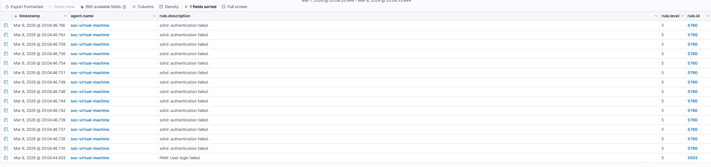
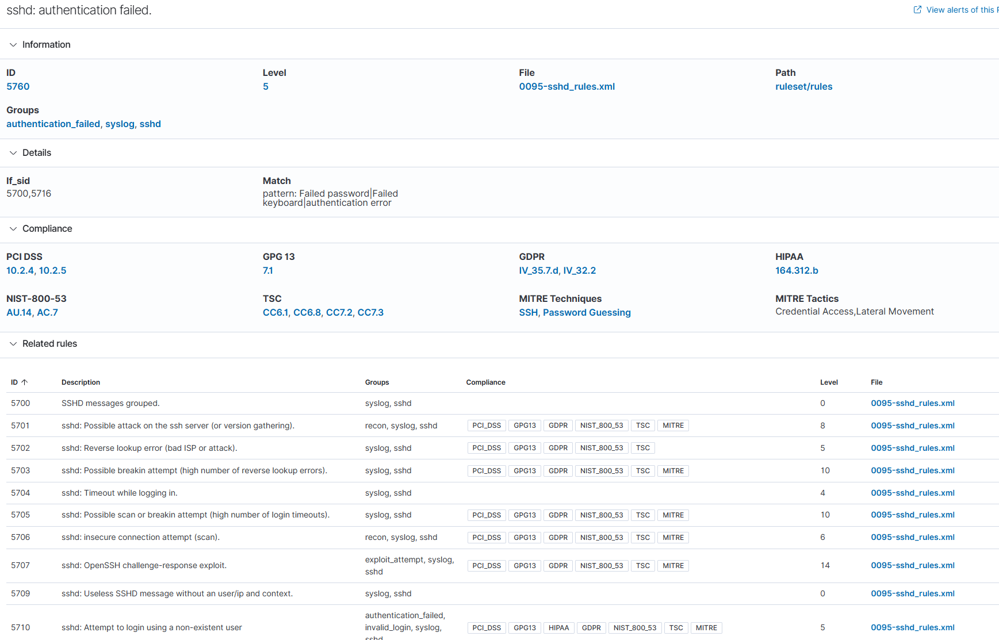
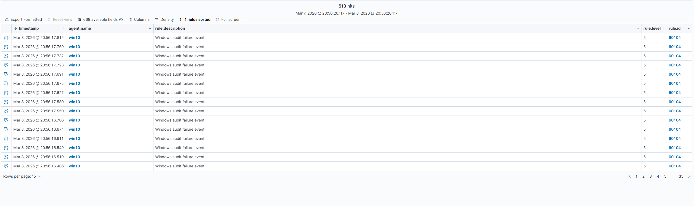

# Detection Analysis

## Summary of Analysis 

After successfully executing simulated attacks , the events generated by these attacks were collected by the Wazuh agents installed on the monitored endpoints.

These events may then be sent to Wazuh server where event analysis was performed using the built-in detection rules . When Wazuh detected a suspicious activity it generated alerts that could be displayed in dashboard.

The following sections will detail each simulated attack that Wazuh was able to detect.

---

## Detection of SSH Bruteforce Attack

### Event Generation

The authentication attempts were tracked by Ubuntu operating system during the bruteforce attack on the Ubuntu endpoint using SSH.

The attempt to login to the Ubuntu endpoint failed so many times that numerous events were produced related to system authentication logs of Ubuntu machine.

The Wazuh Agent collected these logs and forwarded to the Wazuh server.

### Example Logs

Examples of authentication failures demonstrating the attack include logs such as:

Failed password for invalid user

Brute force attacks generally have a pattern of failing authentication attempts repeated numerous times in a relatively short timeframe.

### Wazuh Detection

Wazuh monitors authentication logs for failed logins that match the expected failed login pattern.

Once it detects this behavior, Wazuh will send an alert of suspicious authentication activity as soon as possible.

These alerts enable the SOC analyst to rapidly identify potential brute force attempts and take steps to investigate the attacker.

### Example Alert

## Wazuh Detection Rule

When reviewing the alert generated during the SSH brute force attempt, Wazuh identified the activity using one of its built-in SSH detection rules.

The alert corresponds to Rule ID 5760 , which is triggered when the system logs contain failed SSH authentication attempts. These events usually appear when multiple login attempts are made with incorrect credentials.

This rule is part of the default sshd_rules.xml ruleset and is activated when log entries match patterns such as:

Failed password

Failed keyboard-interactive authentication

In this lab, the repeated login attempts generated by Hydra produced multiple authentication failures in the Ubuntu system logs. These events were collected by the Wazuh agent and forwarded to the Wazuh server, where the detection rule generated the corresponding alerts.

From a SOC perspective, this type of alert is useful because it can quickly highlight possible brute-force attempts against exposed services such as SSH.

MITRE ATT&CK Technique: T1110 — Brute Force

---

## Port Scanning Detection

### Event Generation

The Nmap scan from the Kali Linux machine created multiple attempts at establishing connections to the Windows endpoint.

All attempts to connect were recorded within the Windows security event logs.

These logs were sent by the Wazuh agent located on the Windows machine to Wazuh for analysis.

### Wazuh Log Processing

Wazuh processes the Windows logs that have been forwarded to it from the Wazuh agent on the Windows machine.

Wazuh will identify any abnormal connection activity between the IP address of the Kali Linux machine and port number of the endpoint on Windows.

Multiple attempts to connect to specific endpoint ports can signify they are conducting reconnaissance on the endpoint.

Port scanning is typically one of the primary techniques used by attackers to determine which services running on an endpoint may be exploited. 

### Example Alert

---

## Security Monitoring Value

SIEM tools like Wazuh allow security analysts to find weak spots in their networks through alerts generated during these events. By putting all of their logs together from multiple sources, security teams can see attacks on their network and respond to them as quickly as possible.

The next section covers how SOC analysts could respond after being alerted to these threats.